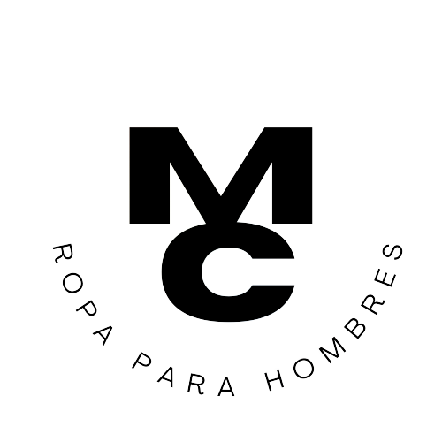

# Ecommerce Clothes-Shop-Merak



Clothes Shop Merak es un proyecto en desarrollo. Se trata de un E-commerce dedicado a la venta de ropa masculina. Está desarrollado con HTML5, CSS3, Javascript y React Js.

El proyecto cuenta con las siguientes opciones:

1) Menu de navegación, donde se puede acceder a las distintas categorías de productos y al carrito de compra. 

2) Vista general de la tienda, en la cual se encuentran todos los productos disponibles en la base de datos de la tienda (haya stock o no), y en la cual se muestran los datos mas relevantes, tales como el precio, el nombre, el stock, la descripción y la imagen de cada producto.

3) Vista del detalle del producto, que permite saber un poco más de cada producto gracias a la descripción del mismo, y donde se puede elegir la cantidad que queramos llevar de cada producto y agregarlo a nuestro carrito.

4) Vista del carrito, donde se pueden observar los productos elegidos por el cliente, la cantidad por la que optó, el precio individual de cada item y el precio en total. También se puede borrar todo el carrito o borrar uno a uno cada producto no deseado.

##  Librerias utilizadas

- [Bootstrap](https://getbootstrap.com/) Para dar forma a la página web.
- [React Router Dom](https://www.npmjs.com/package/react-router-dom) Para la navegación de la página web.
- [React spinners](https://www.npmjs.com/package/react-spinners) Para utilizar un loading.
- [Firebase] (https://firebase.google.com/?hl=es) para crear una base de datos que se conectara con el proyecto.

### Pasos para levantar el proyecto localmente

```  
https://github.com/mateo1496/ClothesShopMerak.git
```

`npm install `

`npm start `


Realizado por Mateo Bertello (https://github.com/mateo1496/ClothesShopMerak.git)

###DEPLOY
- [deploy](https://clothes-shop-merak.vercel.app/) Link del proyecto en Deploy